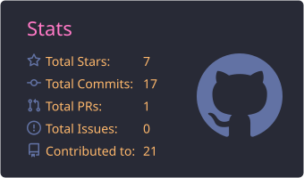
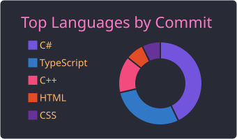

<!-- Header -->

  

 

<h3 align="center">Sobre mim</h3>

  Desenvolvedor <b>Full-Stack</b>, construindo aplicações do banco de dados à interface. 
  Formação técnica em <b>Desenvolvimento de Sistemas</b> pela Escola SENAI Paulo Antônio Skaf. 
  Sempre em busca de novas tecnologias e de formas melhores de resolver problemas.

<h3 align="center">Stack</h3>

**Linguagens** 

**Front-end** 

**Banco de dados** 
&nbsp;&nbsp;

**Cloud** 

**Ferramentas** 

<h3 align="center">GitHub Stats</h3>

  
  
   
  

<h3 align="center">Certificações</h3>

  
  
  
  
  
  

<h3 align="center">Contato</h3>

  
  

 

<picture>
  <source media="(prefers-color-scheme: dark)" srcset="https://raw.githubusercontent.com/LeonardoFuents/LeonardoFuents/output/github-contribution-grid-snake-dark.svg" />
  <source media="(prefers-color-scheme: light)" srcset="https://raw.githubusercontent.com/LeonardoFuents/LeonardoFuents/output/github-contribution-grid-snake.svg" />
  
</picture>

<!-- Footer -->

